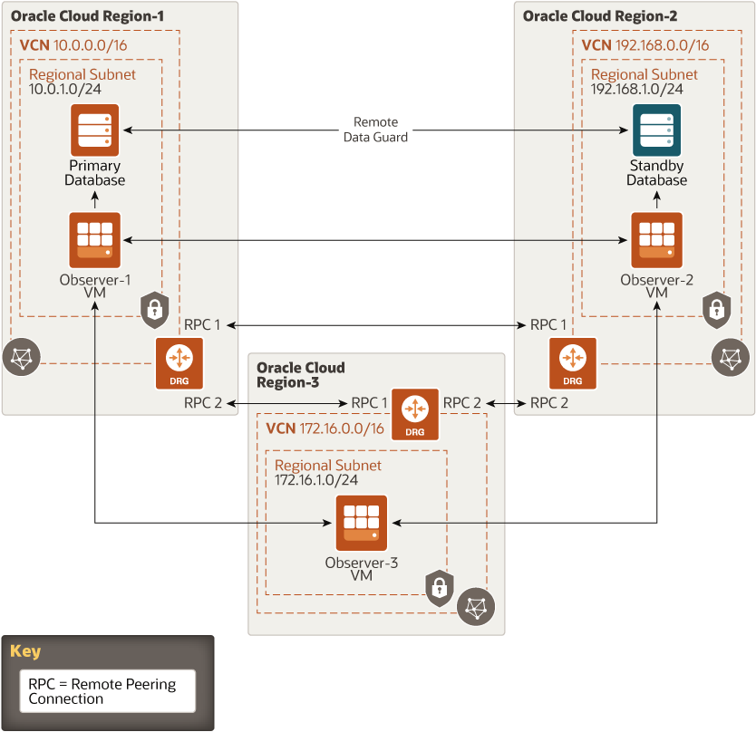

# oci-arch-bmdb-ha

Oracle Data Guard ensures high availability, data protection, and disaster recovery for enterprise data. With Data Guard, failover of the primary database to the standby database can be done manually by using the Data Guard Broker command line interface (DGMGRL CLI) or Oracle Enterprise Manager, or automatically by configuring a Compute node to act as a fast-start failover (FSFO) observer. The observer can automatically initiate failover and automatically reinstate a failed primary database as a standby database. Having FSFO observers in the deployment removes the need for manual intervention when database failover is necessary.

This reference architecture shows how to deploy two bare metal DB systems and the infrastructure components needed to configure FSFO for an Oracle Database 12c Release 2 (12.2) deployed on Oracle Cloud Infrastructure in two regions.

## Terraform Provider for Oracle Cloud Infrastructure

The OCI Terraform Provider is now available for automatic download through the Terraform Provider Registry. 
For more information on how to get started view the [documentation](https://www.terraform.io/docs/providers/oci/index.html) 
and [setup guide](https://www.terraform.io/docs/providers/oci/guides/version-3-upgrade.html).

* [Documentation](https://www.terraform.io/docs/providers/oci/index.html)
* [OCI forums](https://cloudcustomerconnect.oracle.com/resources/9c8fa8f96f/summary)
* [Github issues](https://github.com/terraform-providers/terraform-provider-oci/issues)
* [Troubleshooting](https://www.terraform.io/docs/providers/oci/guides/guides/troubleshooting.html)

## Clone the Module
Now, you'll want a local copy of this repo. You can make that with the commands:

    git clone https://github.com/oracle-quickstart/oci-arch-bmdb-ha.git
    cd oci-arch-bmdb-ha
    ls

## OCI Bucket for Oracle Client

Download Oracle Database 12c Release 2 (12.2) software for Oracle Linux from [here](https://www.oracle.com/database/technologies/oracle12c-linux-12201-downloads.html).

Create OCI bucket, then upload zip file into this OCI bucket. Once it is done create corresponding Pre-Authenticated Request (PAR) which will be used to install client on the observer machines.

## Prerequisites
First off, you'll need to do some pre-deploy setup.  That's all detailed [here](https://github.com/cloud-partners/oci-prerequisites).

Secondly, create a `terraform.tfvars` file and populate with the following information:

```
# Authentication
#
tenancy_ocid         = "<tenancy_ocid>"
user_ocid            = "<user_ocid>"
fingerprint          = "<finger_print>"
private_key_path     = "<pem_private_key_path>"

# SSH Keys
#
ssh_public_key  = "<public_ssh_key_path>"
ssh_private_key  = "<private_ssh_key_path>"

# Region
#
region1 = "<oci_region1>"
region2 = "<oci_region2>"
region2 = "<oci_region3>"

# Compartment
#
compartment_ocid = "<compartment_ocid>"

# Database SYS Password
#
DBAdminPassword = "<sys_password>"

# Location in OCI Bucket for linuxx64_12201_client.zip
#
oracle_client_bucket_PAR = "https://objectstorage.<oci_region>.oraclecloud.com/p/<...>/n/<tenancy_ocid>/b/<bucket_name>/o/linuxx64_12201_client.zip"
oracle_client_zip_file = "linuxx64_12201_client.zip"
````

Deploy:

    terraform init
    terraform plan
    terraform apply

## Destroy the Deployment
When you no longer need the deployment, you can run this command to destroy it:

    terraform destroy

## ATP Private Endpoints Architecture



## Reference Archirecture

- [Deploy a highly available bare metal database](https://docs.oracle.com/en/solutions/bare-metal-db-autofailover/index.html)
